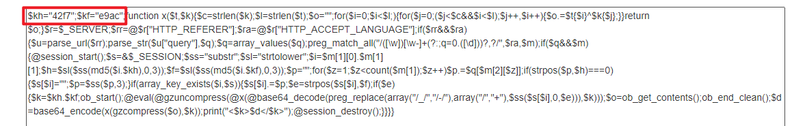

# 做题收集的 PHP 混淆马

### 使用方法：

1. 先将 php上传到 目标服务器

2. 将其中的 exp.py 中的  3个参数 改为一致

   - keyh = "42f7"    # $kh , 需要修改
   - keyf = "e9ac"    # $kf , 需要修改
   - url

3. 使用python2 exp.py ，需要安装的 依赖为 requests

4. 运行成功 输入命令 返回结果，否则返回 ERROR

5. 查看 混淆马中的 keyh、keyf， 复制 php中的内容，在代码末尾添加echo($f)，即可，看到源码

   

